# jPlot 📈

jPlot is a high-performance, lightweight Java 2D plotting engine specifically designed for scientific visualization, data analysis, and professional reporting. It features a custom rendering pipeline optimized for pixel-perfect accuracy and high-resolution output.

## Technical Highlights

* **SDF-Based Antialiasing:** Unlike standard rendering, jPlot uses Signed Distance Fields to calculate sub-pixel coverage, ensuring razor-sharp curves and eliminating artifacts at line intersections.
* **Professional Alpha Compositing:** Implements true alpha blending and max-splatting algorithms, allowing for clean visualization of dense, overlapping datasets without color "muddiness."
* **Headless 4K Rendering:** Designed to operate without a GUI, enabling the generation of massive ultra-high-definition (3840x2160+) charts directly to disk.
* **First-Class Function Plotting:** Support for native Java Lambda expressions to render mathematical functions with infinite precision.
* **Facade Pattern Architecture:** Strict separation of mathematical modeling, rendering, and API presentation for a zero-configuration developer experience.

---

## Visual Gallery

### 🌡️ Heatmap Density Analysis
Multi-class distribution rendering with alpha-blended Gaussian splatting.
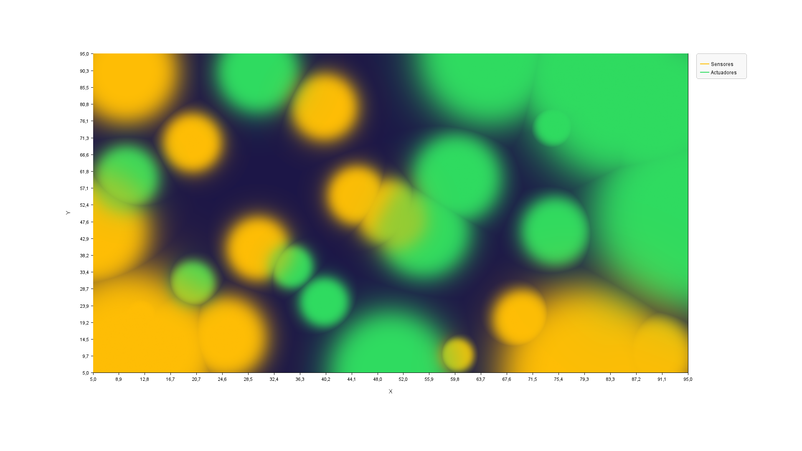

### 📊 Statistical Histograms
Auto-binning and alpha-blended distributions for continuous variables.
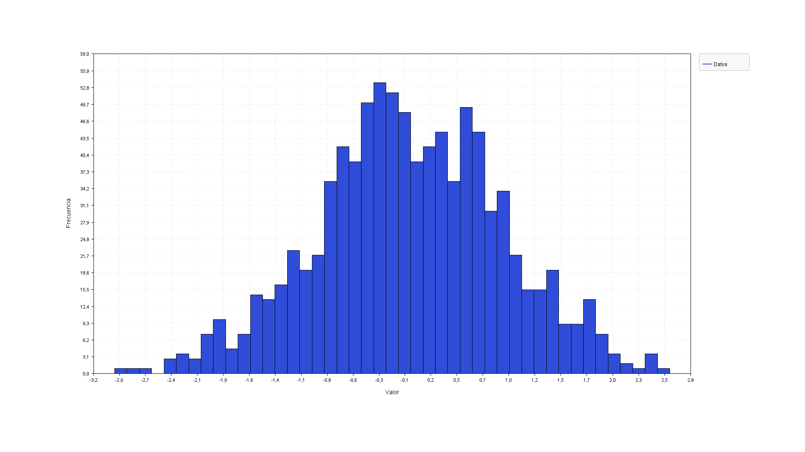

### 📍 Discrete Time Signals (Stem Plot)
SDF-rendered stems and programmable markers for DSP applications.
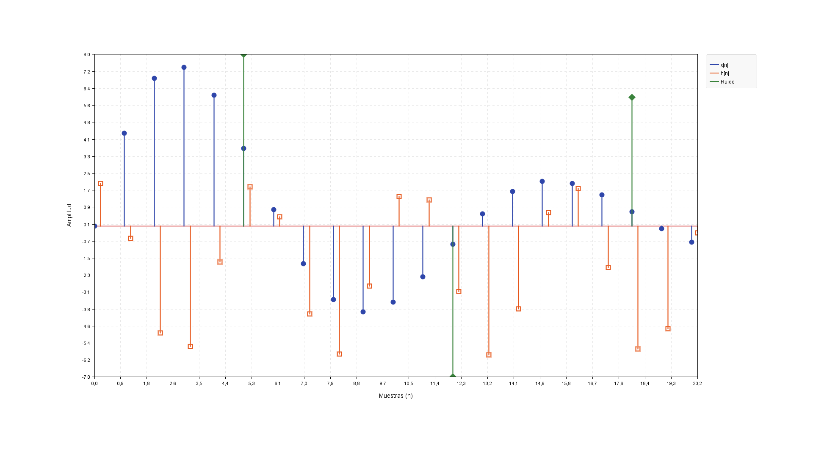

### 📉 Categorical Time-Series (Polyline & Step Plots)
Custom axis formatting and orthogonal step plotting for indexed and temporal data.
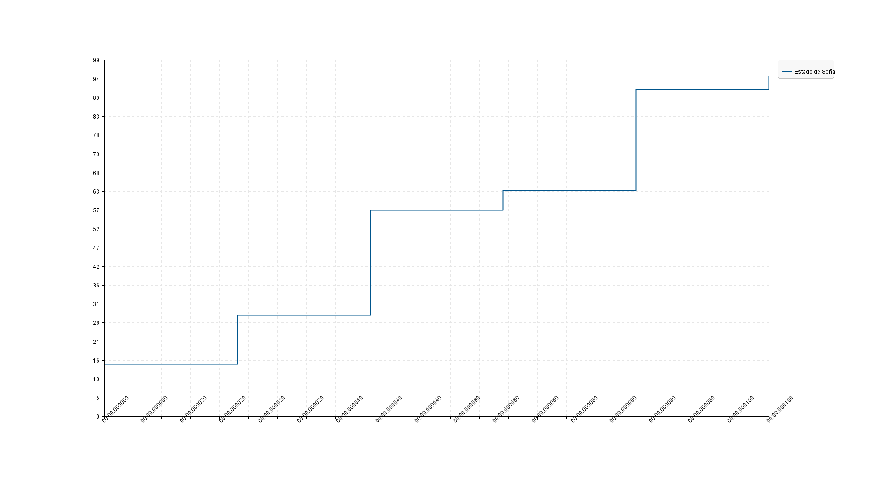
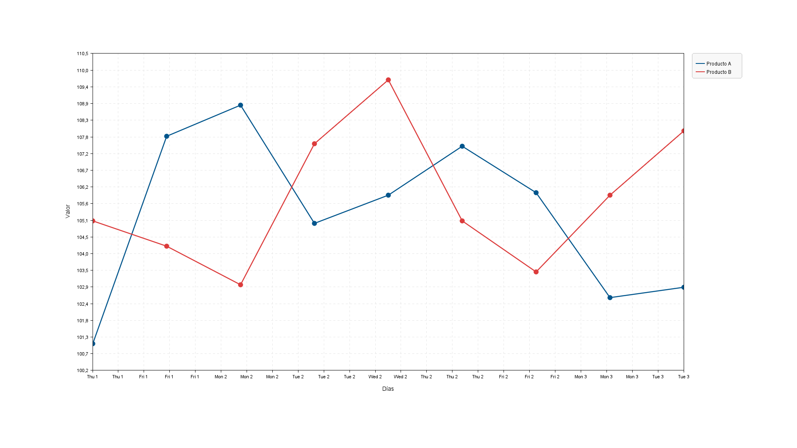

### 🏢 Grouped & Stacked Bars
Financial reporting with automatic spatial grouping and cumulative limit scaling.
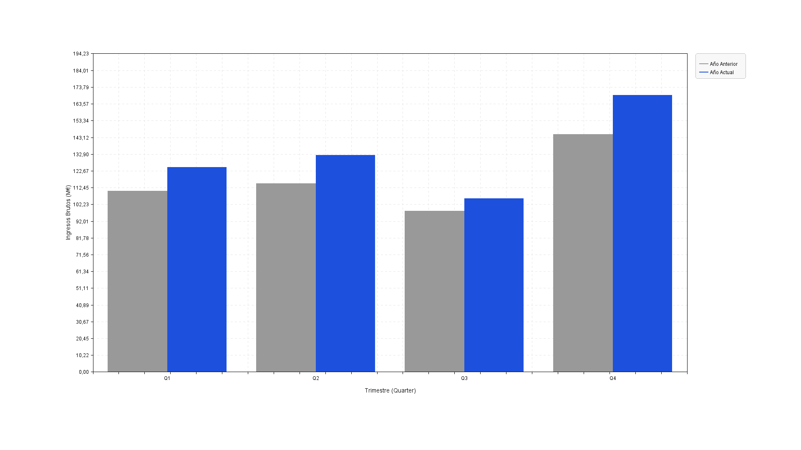
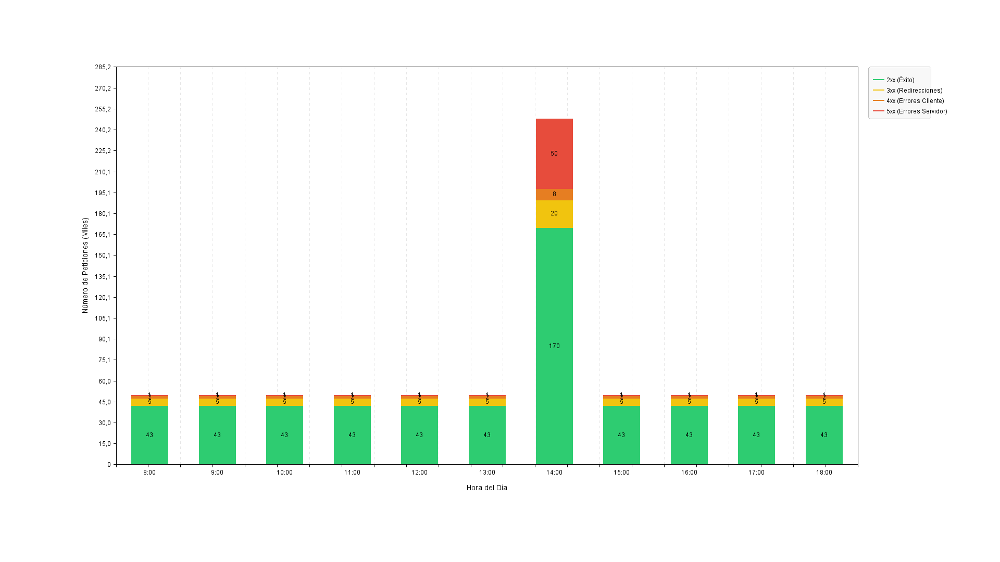

### 🔭 Scientific & Mathematical Functions
Advanced rendering of trigonometric and polynomial functions using smooth-step interpolation.
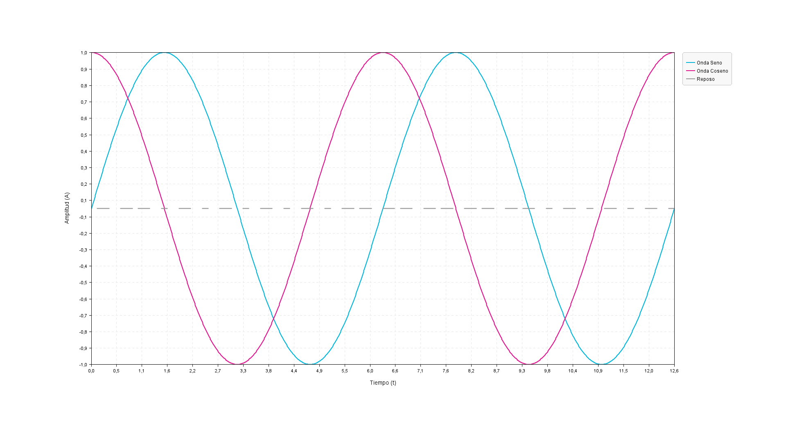

### 🌌 High-Density Data (Bubble Charts)
Visualization of massive datasets using custom alpha-blending to highlight clusters.
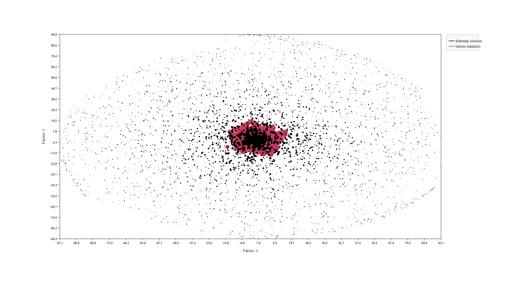

### 🍰 Sector Distribution (Pie Chart)
Clean pie charts with precise radial SDF antialiasing for professional reports.
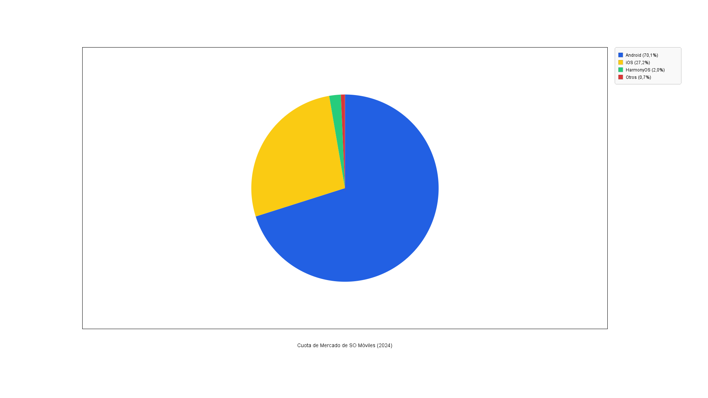

### 📏 Linear Classification & Geometry
Intersection of functional lines with scattered datasets, demonstrating spatial classification.
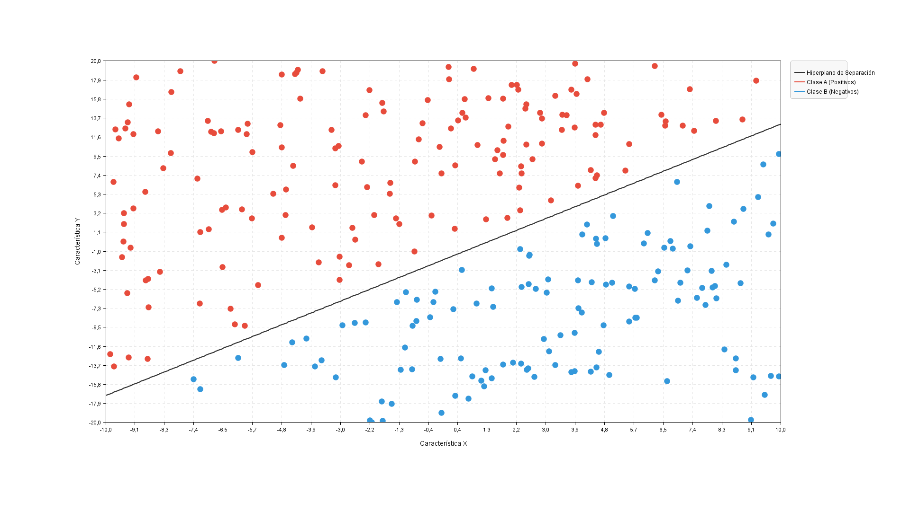

### 📑 Horizontal Comparisons
Optimized layout for categorical rankings and comparative horizontal analysis.
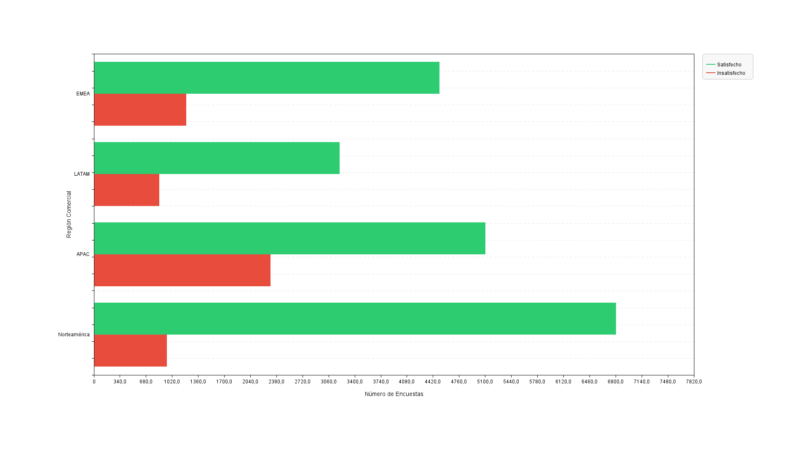
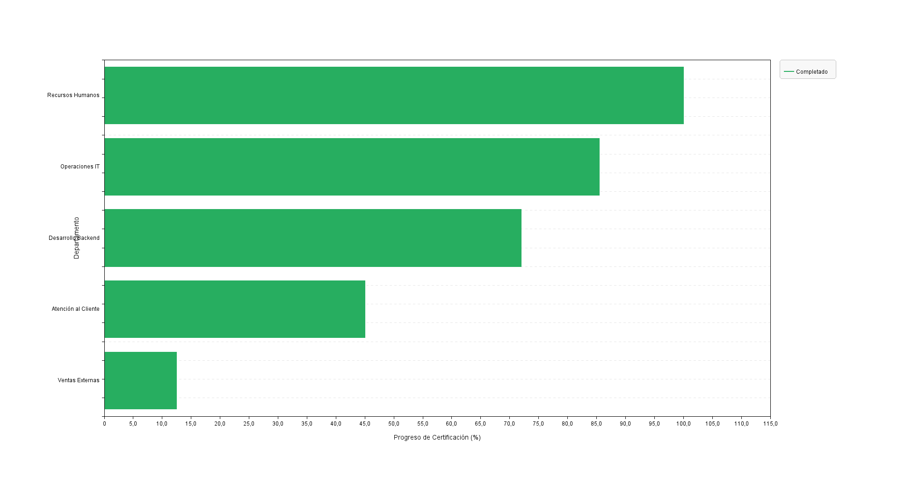

---

## 🖼️ Multi-Chart Dashboards & Composition
The `MultiPlotter` engine allows for the orchestration of multiple independent charts into a unified grid-based dashboard.

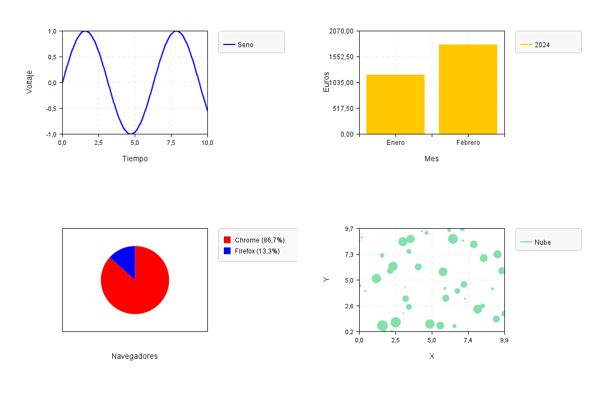

---

## Quick Start

### 1. Basic Line Chart
```java
import ui.Plotter;
import java.awt.Color;

public class ChartApp {
    public static void main(String[] args) {
        Plotter p = new Plotter("Performance Metrics", Plotter.LINE_PLOT, "Time", "Value");
        p.create(new Color(41, 128, 185), "name", "Sensor A", "type", "LINE", "style", "SOLID");
        p.add("Sensor A", 1.0, 10.5);
        p.add("Sensor A", 2.0, 15.2);
        p.img(3840, 2160, "output.png");
    }
}
```

### 2. Functional Plotting
```java
import ui.Plotter;
import java.awt.Color;

public class MathAnalysis {
    public static void main(String[] args) {
        Plotter p = new Plotter("Waveform", Plotter.LINE_PLOT, "X", "Y");
        p.create(Color.RED, "name", "Sine Wave", "type", "FUNCTION");
        p.add("Sine Wave", 0.0, 10.0, 1000, x -> Math.sin(x));
        p.img(1920, 1080, "function.png");
    }
}
```

### 3. Categorical Polyline
```java
import ui.Plotter;
import java.awt.Color;

public class CategoryApp {
    public static void main(String[] args) {
        Plotter p = new Plotter("Weekly Index", Plotter.POLYLINE_PLOT, "Days", "Value");
        p.create(new Color(0, 85, 140), "name", "Metric", "marker", "CIRCLE");

        p.add("Metric", "Mon", 100.2);
        p.add("Metric", "Tue", 108.3);
        p.add("Metric", "Wed", 105.0);

        p.plot();
    }
}
```

---

## Installation
Currently, jPlot can be integrated by including the `src` files into your project. No external dependencies are required.

## License
This project is licensed under the MIT License - see the [LICENSE](LICENSE) file for details.
