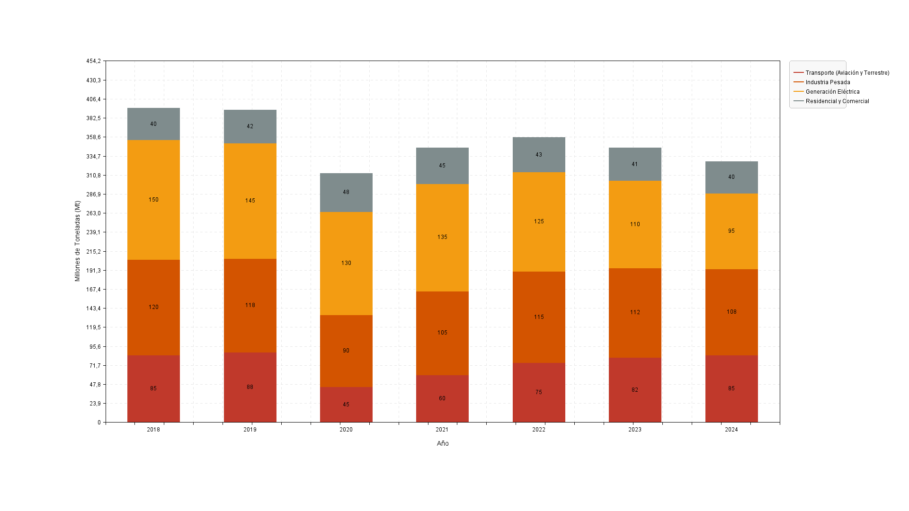

# jPlot 📈

jPlot is a high-performance, lightweight Java 2D plotting engine specifically designed for scientific visualization, data analysis, and professional reporting. It features a custom rendering pipeline optimized for pixel-perfect accuracy and high-resolution output.

## Technical Highlights

* **SDF-Based Antialiasing:** Unlike standard rendering, jPlot uses Signed Distance Fields to calculate sub-pixel coverage, ensuring razor-sharp curves and eliminating artifacts at line intersections.
* **Professional Alpha Compositing:** Implements true alpha blending and max-splatting algorithms, allowing for clean visualization of dense, overlapping datasets without color "muddiness."
* **Headless 4K Rendering:** Designed to operate without a GUI, enabling the generation of massive ultra-high-definition (3840x2160+) charts directly to disk.
* **First-Class Function Plotting:** Support for native Java Lambda expressions to render mathematical functions with infinite precision.

---

## Visual Gallery

### 🔬 Scientific & Mathematical Functions
Advanced rendering of trigonometric and polynomial functions using smooth-step interpolation.


### 🌌 High-Density Data (Bubble Charts)
Visualization of 4,000+ data points using custom alpha-blending to highlight density clusters.


### 📊 Corporate & Financial Analytics
Versatile support for grouped, stacked, and horizontal bar charts with optimized label placement.


### 🍰 Sector Distribution
Clean pie charts with precise radial antialiasing for professional business reports.


---

## Quick Start

### Basic Line Chart
```java
import ui.Plotter;
import java.awt.Color;

public class Main {
    public static void main(String[] args) {
        Plotter p = new Plotter("Performance Metrics", Plotter.LINE_CHART, "Time", "Value");

        // Create a series with custom styling
        p.create(new Color(41, 128, 185), "name", "Sensor A", "type", "LINE", "style", "SOLID");

        // Add data
        p.add("Sensor A", 1.0, 10.5);
        p.add("Sensor A", 2.0, 15.2);
        //p.plot();
        // Export to 4K image
        p.img(3840, 2160, "output.png");
    }
}
```

### Plotting Functions
```java
import ui.Plotter;
import java.awt.Color;

public class MathMain {
    public static void main(String[] args) {
        Plotter p = new Plotter("Function Visualization", Plotter.LINE_CHART, "X-Axis", "Y-Axis");

        p.create(new Color(192, 57, 43), "name", "Parabola", "type", "FUNCTION", "style", "SOLID");
        p.add("Parabola", -10.0, 10.0, 1000, x -> Math.pow(x, 2));
        p.plot();
        //p.img(1920, 1080, "function.png");
    }
}
```

---

## Installation
Currently, jPlot can be integrated by including the `src` files into your project. Future releases will include Maven/Gradle support.

## License
This project is licensed under the MIT License - see the [LICENSE](LICENSE) file for details.
